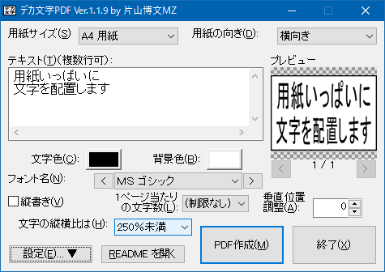

#  デカ文字PDF by 片山博文MZ

「デカ文字PDF」は、ページいっぱいの大きな文字列でPDFファイルを出力するソフトです。

完成したPDFファイルはデスクトップに作成されます。

	

次のテキストの配置方法が選べます:

- ページいっぱいにテキストを配置（縦横比を保つ）
- ページいっぱいにテキストを配置（縦横比を無視する）
- 1ページに1文字ずつ配置

## 対応環境

- 日本語 Windows XP/Vista/7/10/11

## 注意

- ユーザー名に機種依存文字が含まれている場合はサポート対象外です。

## 使用許諾

このプログラムは、試用期間のある777円（手数料等別途）のシェアウェアです。
継続して使用する場合はソフト配布サイトの [Vector（ベクター）](https://www.vector.co.jp) でお支払い下さい。
詳しくはファイル [LICENSE.txt](LICENSE.txt) をご覧下さい。

このプログラムを使って生じた如何なる損害も当方は責任を負いません。

## 連絡先

電子メール katayama.hirofumi.mz@gmail.com でご連絡下さい。

ホームページ：[https://katahiromz.web.fc2.com/](https://katahiromz.web.fc2.com/)
